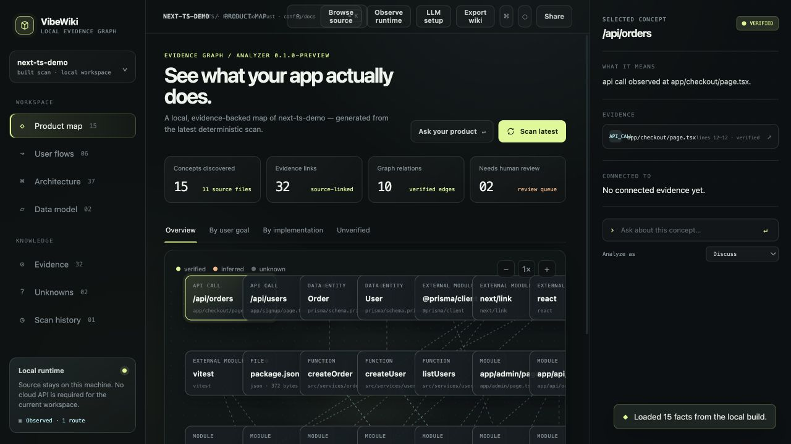

# VibeWiki

**Evidence-based product reverse engineering for AI-built codebases — from source scan to runtime evidence.**

<p align="center">
  
</p>

<p align="center">
  
</p>

> Live preview from the local `scan → build → serve` workflow.

> VibeWiki is a local-first codebase intelligence tool for developers who need
> to understand what an AI-assisted codebase actually does.

**Latest verified preview:** [`v0.1.46-preview`](https://github.com/jamesdong95/vibewiki/releases/tag/v0.1.46-preview) · scan a repository locally or import a public GitHub URL, preserve nested monorepo paths, select a primary package, retain only its transitive workspace dependency closure, build a reverse graph, review file and graph changes after every rescan, inspect bounded inline source diffs with line numbers, triage every Unknown through an Open/All queue, bulk-review selected findings atomically, mark findings reviewed with local notes and reopen them later, configure product intent from the viewer, compare expected flows to implementation evidence, detect Astro/Nuxt filesystem routes, browse common source/config formats, resolve workspace package imports and path aliases, persist imported snapshots across restarts, reopen or refresh recent workspaces, forget only managed cache copies, restore non-secret LLM preferences, format grounded AI answers, inspect source-linked facts, observe a local runtime, and keep shared binds behind bearer authentication with remote-LLM source redaction.

When implementation moves faster than documentation, VibeWiki is designed to connect:

```text
product concept → user flow → route/screen → API endpoint → service/function
→ database entity → source code → test/commit
```

The important design rule is **facts first, interpretation second**. Claims should point to a file, line, route, schema, test, commit, or runtime trace. If the repository does not provide enough evidence, VibeWiki should say so instead of presenting a guess as truth.

## Current status

This repository is a **local-first end-to-end preview** for developers and teams
who need a fast, inspectable map of an unfamiliar codebase. It currently
contains:

- A standalone dark developer-tool UI in [`viewer/index.html`](viewer/index.html).
- A generated hero illustration in [`docs/assets/vibewiki-hero.png`](docs/assets/vibewiki-hero.png).
- The product development plan in [`docs/product-development-plan.md`](docs/product-development-plan.md).
- An offline verification script in [`scripts/verify_preview.py`](scripts/verify_preview.py).
- An offline `scan → build → serve` pipeline that writes deterministic source
  facts, a content-addressed inventory of every non-ignored file, a SQLite
  graph, Markdown/Mermaid wiki, and a local viewer backed by the built artifact.

The screenshot above is the real viewer produced by that local workflow: the
selected concept, reverse graph, evidence lines, scan history, and runtime
status are all rendered from the generated artifact rather than a mock API.

The semantic analyzer is intentionally deterministic: it covers Next.js App
Router, generic JavaScript/JSX/TypeScript/TSX repositories, common source
languages such as Python, Go, Rust, Java/Kotlin, Ruby/PHP, C/C++/C#, Swift,
Dart, shell and SQL, plus Prisma models, markup, configuration, documentation,
CommonJS/ESM module references, Python/Go/Rust/Java-family/C-family local module
references, TypeScript/JavaScript `paths` aliases from `tsconfig.json` or
`jsconfig.json`, and test links. The extra language adapters are conservative
regex-based facts rather than full compiler ASTs; files whose semantics are not
recognized still remain visible as inventory evidence. LLM
reasoning, runtime exploration, and network access are not required.

## Preview the UI

Requirements: Python 3.11+. For a checkout, `uv` is recommended; a built
wheel also includes the viewer asset for clean installs.

Install from a local checkout:

```bash
python3 -m venv .venv
. .venv/bin/activate
python -m pip install -e .
```

Then run the end-to-end workflow:

```bash
vibewiki scan tests/fixtures/next-ts-demo
vibewiki build tests/fixtures/next-ts-demo
vibewiki serve tests/fixtures/next-ts-demo --port 4173
```

The same `vibewiki serve` command works after installing a wheel; it does not
depend on the repository's `viewer/` directory being present at runtime.

For a static presentation-only preview, Python's built-in HTTP server is also
available:

```bash
python3 -m http.server 4173 --bind 127.0.0.1 --directory viewer
```

Then open <http://127.0.0.1:4173/>.

For a deliberate LAN/shared preview, opt in explicitly:

```bash
uv run vibewiki serve /path/to/repository --host 0.0.0.0 --port 4173 --share
```

The ready JSON prints a one-time browser access URL and bearer token. The first
browser visit exchanges the token for an HttpOnly session cookie and cleans the
URL; all viewer/API routes remain protected. Keep the token private and prefer
loopback when sharing is not needed.

The local product provides:

- Product map and evidence-oriented graph navigation.
- Inspector panels for routes, flows, APIs, services, entities, tests, and commits.
- Search, graph zoom, node selection, and command-palette interactions.
- One-click ZIP export of the generated wiki, graph, evidence, and unknowns
  artifacts without bundling source files.
- Explicit confidence, unknowns, and local-runtime status.
- Copy a local viewer link while the loopback server is running, plus source-free
  ZIP export for sharing the generated wiki artifact.
- A safe local Browse flow with folder-picker and local-path fallbacks, bounded
  import limits, ignored directories, secret-name filtering, package-scope
  detection, and explicit scan/rescan status.
- A project profile and source inventory that make package scope, language
  coverage, stale files, and file-level evidence visible before interpretation.
- A bounded **Change review** in Scan history that separates file changes from
  added/changed/removed graph nodes and edges, with links back to current
  concepts and evidence paths.
- A **Product intent** form that writes a validated local seed, rescans the
  workspace, and turns missing expected route/API/file/test evidence into
  explicit Unknowns without requiring manual YAML editing.
- A local-first visual language that does not require a hosted backend.

Runtime observation is available as an explicit, safe baseline. Start a local
application, then run:

```bash
uv run vibewiki observe http://127.0.0.1:3000 --repository /path/to/repo
```

The observer follows same-origin document routes with bounded `GET` requests,
never submits forms, and refuses remote hosts unless `--allow-network` is
passed explicitly. The viewer's **Observe runtime** button uses the same
loopback-only default. Results are written to `.vibewiki/runtime.json`, shown
through `/api/runtime`, and included in the source-free export. HTTP mode does
not execute JavaScript, so browser-only behavior remains unknown there. For a
browser-backed local probe, install the optional adapter and Chromium once:

```bash
uv sync --extra runtime
uv run playwright install chromium
uv run vibewiki observe http://127.0.0.1:3000 \
  --repository /path/to/repo --mode browser --screenshots
```

Browser mode runs headless with a fresh context, follows same-origin routes,
blocks cross-origin and non-GET requests, and never submits forms or performs
authentication. Observed routes and API requests are joined to matching graph
nodes by path/method; selected nodes show runtime status and console errors in
the inspector. The viewer exposes the same choice from **Observe runtime**.

## Product direction

The shortest end-to-end local flow is:

```bash
uv run vibewiki serve /path/to/repository --port 4173
```

If `.vibewiki/graph.json` is missing, `serve` automatically runs the same local
scan + build flow before opening the viewer. It prints `auto_analyzed: true` in
the ready event and keeps the existing artifact if preparation fails. For a
separate, scriptable analysis result, use `analyze`; it auto-detects a direct
Next.js App Router and otherwise uses the generic local analyzer. The explicit
two-step form remains available when you want to inspect each stage:

```bash
uv run vibewiki scan /path/to/repository
uv run vibewiki build /path/to/repository
uv run vibewiki serve /path/to/repository --port 4173
```

Use `--generic` to force the broader source/config/docs registry or
`--strict-next` to preserve the original direct App Router validation.

Generic mode keeps every supported file in inventory and recognizes common
route registrations in Express/Fastify/Hono-style JavaScript, React Router JSX
and `createBrowserRouter` route objects, Flask/FastAPI, and Go `HandleFunc`
code, Next.js Pages Router files, Vue Router `createRouter` route objects,
Angular Router route arrays, NestJS controller decorators, and SvelteKit
`src/routes` files, plus literal fetch/Axios/common `apiClient` wrapper calls.
Matching API calls are linked to generic route nodes when the method and path
are literal.
Unrecognized constructs remain source/module evidence rather than being
presented as verified behavior.

Astro `src/pages/*.astro` and Nuxt `pages/*.vue` routes are also mapped with
deterministic filesystem evidence, including `index` and bracket-style dynamic
segments such as `[slug]`.

For JavaScript/TypeScript monorepos, reverse edges also resolve local package
names such as `@acme/ui` and subpaths such as `@acme/ui/button` from package
manifest entry points and safe `exports` conditions. Package configuration is
read as data only; scripts are never executed.

Open `http://127.0.0.1:4173/` to inspect the generated graph, evidence and
unknowns. By default the server binds to loopback and does not contact
external services.
You can also use **Browse source** in the viewer to choose a local source
folder. Browse accepts common source, config, and documentation files
(including JavaScript/JSX, TypeScript/TSX, Python, Go, Rust, Java/Kotlin,
C-family, Swift/Dart, shell, SQL, Astro, GraphQL, Protobuf, Terraform/HCL,
PowerShell, Perl, R, Solidity, markup, JSON/YAML/TOML and Markdown), plus
Prisma. It detects a supported package inside common monorepos and shows
skipped-file or size-limit errors before import. If the whole repository is
larger than the local safety limit, Browse offers bounded package candidates
such as `apps/frontend` or `packages/web` instead of failing the entire scan.
Selected supported files are sent only to this loopback process, scanned
locally, and the temporary imported workspace is removed when the server exits.
If the browser cannot open a directory picker, use **Use local path** in the
viewer; the loopback server reads the path locally, applies the same limits and
secret filters, and imports a temporary snapshot without mutating the source.
For an explicit remote workflow, **Import GitHub** accepts a public HTTPS
`github.com/owner/repo` URL and optional branch/tag. It downloads a bounded
archive only after the user submits the form, applies the same supported-file,
ignore, secret, package-scope, file-count, and byte limits, and removes the
temporary snapshot when the server exits. Private repositories and authenticated
GitHub access stay local: clone them first, then use Browse or Use local path.
The project switcher and workspace summary retain a safe provenance label after
the graph reloads, such as `GitHub · owner/repo@main` or `local-path · my-app`;
absolute local paths and credentials are never exposed in the viewer.
After the graph is open, **Rescan workspace** runs scan + build against the
current local workspace. It snapshots `.vibewiki/` first and restores the last
known-good artifact if the rescan fails, so a temporary source error does not
blank the current graph.
The CLI keeps byte-compatible strict discovery for a direct Next.js App Router
and auto-selects the generic local import profile for other repositories.

After a build, **Source files** in the Knowledge sidebar opens the indexed
inventory. Filter by path or language, see stale files, and click a file to
preview bounded source lines without leaving the local viewer.
From the project switcher, **Project profile** lists detected package scopes;
choose a repository root or nested package to focus the graph, evidence, and
inspector without importing the source again.

The server remains offline when no LLM provider is configured. If a remote
provider is explicitly enabled, only the bounded retrieved context for the
current question is sent to that provider; source import and graph generation
remain local.

Every build also exposes `/api/profile`, `/api/files`, `/api/packages`, `/api/modules`,
`/api/symbols`, `/api/source`, `/api/history`, `/api/stale`, `/api/impact`,
`/api/intent`, `/api/changes`, `/api/import-github`, `/api/llm/status`, and `/api/ask` for bounded local evidence inspection and
optional grounded discussion. `/api/impact` accepts a node subject plus
`direction=upstream|downstream|both`, and returns a bounded deterministic
neighborhood with the original edge evidence. Use `vibewiki history
/path/to/repo <path-or-node>` for the same scan history from the CLI.
Package, symbol, and call edges are deterministic; source evidence is served
by relative path and line range only. Traversal, symlinks, ignored paths, and
sensitive names are rejected.

### Compare product intent with the implementation

For a lightweight product contract, add `product.seed.yaml` at the repository
root. VibeWiki compares each expected route, API, test, file, function, module,
symbol, entity, or package with deterministic scan facts and exposes the result
in `.vibewiki/intent.json`, `/api/intent`, and the viewer's Unknowns view. Missing
expectations become explicit `intent_gap` findings rather than LLM guesses.
Start from [`docs/product.seed.example.yaml`](docs/product.seed.example.yaml).

Every scan records a bounded local history in `.vibewiki/history.json`. If a
source file changes after the last build, the server compares its current hash
with the built inventory and marks affected node/edge evidence as `stale`; it
does not pretend the old line reference is current.

The planned pipeline is:

```text
file discovery and static analysis
        ↓
deterministic facts and evidence
        ↓
local SQLite graph and claims
        ↓
Markdown/Mermaid product wiki and viewer
        ↓
optional bounded retrieval for local Q&A
```

The core remains useful without an LLM. Configure the optional discussion layer
with Ollama on the local machine:

```bash
export VIBEWIKI_LLM_PROVIDER=ollama
export VIBEWIKI_LLM_MODEL=qwen2.5:7b
export VIBEWIKI_LLM_BASE_URL=http://127.0.0.1:11434
# Or pass --llm-provider/--llm-model/--llm-base-url to `vibewiki serve`.
```

Or use a BYOK OpenAI-compatible endpoint from the server environment:

```bash
export VIBEWIKI_LLM_PROVIDER=openai-compatible
export VIBEWIKI_LLM_MODEL=your-model
export VIBEWIKI_LLM_API_KEY=your-key
export VIBEWIKI_LLM_BASE_URL=https://api.example.com
```

The default provider is `none`: VibeWiki returns deterministic evidence-only
results. When a model is enabled, retrieval sends only bounded graph neighbors
and cited source excerpts, never the whole repository. API keys stay server-side
and are not written to `.vibewiki` or returned by the status endpoint.

You can also click **LLM setup** in the viewer's Local runtime card. The form
updates the running server in memory; restarting the server clears that runtime
configuration unless environment variables or CLI flags are supplied again.

The Ask panel supports four grounded use cases: **Discuss** for general
questions, **Explain flow** for graph-connected execution paths, **Impact
analysis** for connected neighborhoods, and **Find unknowns** for gaps already
recorded by the analyzer. With provider `none`, each mode still returns a
deterministic evidence-only result, so the graph remains useful without a
model. Provider Markdown is normalized for readable headings, separators, and
escaped newlines; fenced code blocks are preserved.

Use **Export wiki** in the top bar or command palette to download a ZIP of the
current `.vibewiki` artifacts. The export includes Markdown/Mermaid wiki files,
graph JSON/SQLite, evidence manifests, and unknowns; it deliberately excludes
repository source files.

## Evidence model

A future claim should carry enough metadata to be inspected and challenged:

```json
{
  "claim": "Checkout creates an order",
  "status": "verified",
  "confidence": "medium",
  "evidence": [
    "app/checkout/page.tsx:42",
    "app/api/orders/route.ts:18",
    "tests/checkout.test.ts:11"
  ],
  "unknowns": ["Runtime payment provider was not observed"]
}
```

Planned evidence states include `verified`, `inferred`, `unknown`, and `stale`. Sensitive values should be redacted before indexing; source code should stay on the user's machine by default.

## Repository layout

```text
.
├── docs/
│   ├── assets/vibewiki-hero.png
│   ├── product.seed.example.yaml
│   └── product-development-plan.md
├── scripts/
│   └── verify_preview.py
├── viewer/
│   └── index.html
├── CHANGELOG.md
├── CONTRIBUTING.md
├── LICENSE
├── README.md
└── VERSION
```

## Verify the repository

Run the deterministic offline checks:

```bash
python3 scripts/verify_preview.py
```

The check validates required files, the PNG signature, the viewer's essential
UI hooks, README asset references, and obvious credential-assignment patterns.

The semantic pipeline is still intentionally narrower than a general-purpose
analyzer. It recognizes direct Next App Router routes specially and accepts
generic source/config/docs in local Browse imports. It records deterministic
facts for routes, API calls, functions/classes in supported language adapters,
Prisma models, imports, writes, calls, test links, and reverse module
dependencies. The separate inventory records non-ignored text and binary files
with path, type, size, and SHA-256 metadata without indexing secret content.
The viewer reads `.vibewiki/graph.json` through the loopback API; it does not
use the presentation fixture when running under `vibewiki serve`.

## Roadmap

1. Establish the product contract and a small fixture repository.
2. Add file discovery and deterministic Next.js/TypeScript facts.
3. Persist sources, nodes, edges, claims, and evidence in SQLite.
4. Generate Markdown/Mermaid wiki pages and replace demo data in the viewer.
5. Add bounded runtime observation evidence with safe read-only defaults. *(HTTP mode in 0.1.4-preview; browser mode and graph linkage in 0.1.6-preview)*
6. Package clean installs and CI gates for external users.
7. Add broader language/framework adapters behind fixture-backed gates.

See the detailed phase plan in [`docs/product-development-plan.md`](docs/product-development-plan.md).

## Privacy principles

- Local-first by default; scanning should not require a hosted service.
- No full-repository prompt by default; retrieve only relevant symbols/modules.
- Non-loopback viewer binds require explicit `--share` bearer authentication;
  remote LLM prompts require confirmation and redact detected credential values.
- No credential storage or proxying by VibeWiki.
- Redact secrets and sensitive values before writing evidence or claims.
- Separate deterministic facts from model-generated interpretation.

## Contributing

The project is intentionally early. Please read [`CONTRIBUTING.md`](CONTRIBUTING.md), run the verification script, and keep changes honest about what is implemented versus planned. New product claims should include a source or be marked as an assumption.

## License

VibeWiki is released under the MIT License. See [`LICENSE`](LICENSE).
